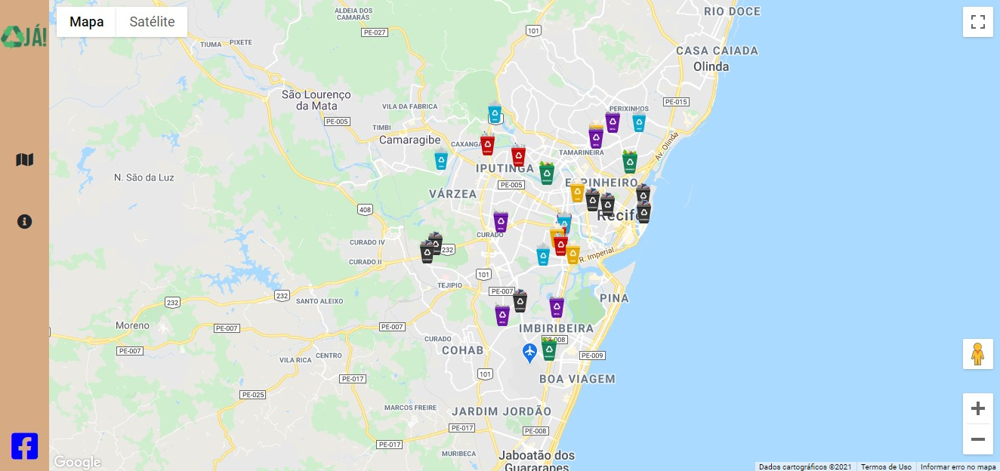

<center></center>

<br/>

# Hackaton SOFTEX - Recicle :recycle: Já
Hackaton oferecido pela SOFTEX como finalização do curso de desenvolvimento de software.

## :memo: **Sobre**
Este projeto foi criado com o intuito de informar e tornar mais rápido a localização dos pontos de coleta no Recife, aqui você pode escolher o ponto de coleta pelo tipo de residuo que queira entregar, além de promover ações para estimular a reciclagem e outros assuntos relacionados, mostrando a importância e os benefícios da reciclagem.

### :video_camera: **Video sobre o projeto**

https://youtu.be/9YKGhhUAaQY

### :speech_balloon: **Tema**

*ODS 12 – Consumo e produção responsáveis*

<br/>

## 🖥️ Aparência do site


<br/>

## 👷 Como rodar

```bash
# Clone o repositório
git clone https://github.com/viniciusFelipeS/hackaton-softex

# Altere o nome do arquivo
.env.exemple --> .env

# Altere as configurações do .env 
# principal alteração:
URL_BASE:localhost/seu_diretorio

# Importe o banco de dados
```

## :computer: **Tecnologias utilizadas**
 


# :busts_in_silhouette: **Autores**
Nome  | E-mail
:---|:---:
[Vinícius](https://github.com/viniciusFelipeS) | viniciusfelipe.xd@gmail.com 
[Eduardo](https://github.com/EM180303) | e.marques180303@gmail.com
[Nicolas](https://github.com/nicolasmonteiro) | nicolas-monteiro@outlook.com
[izadora](https://github.com/izadora-oliveira) | izamartins7@outlook.com
 


